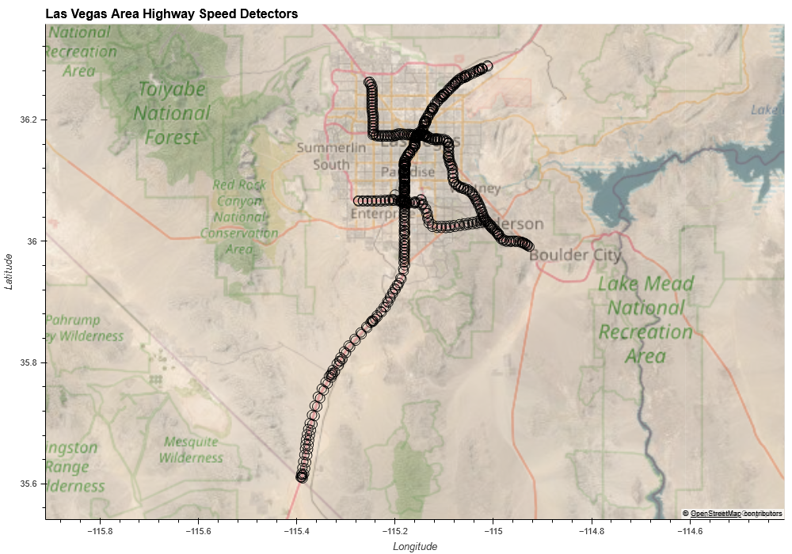
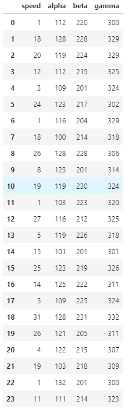
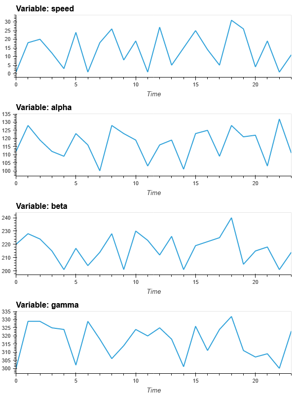
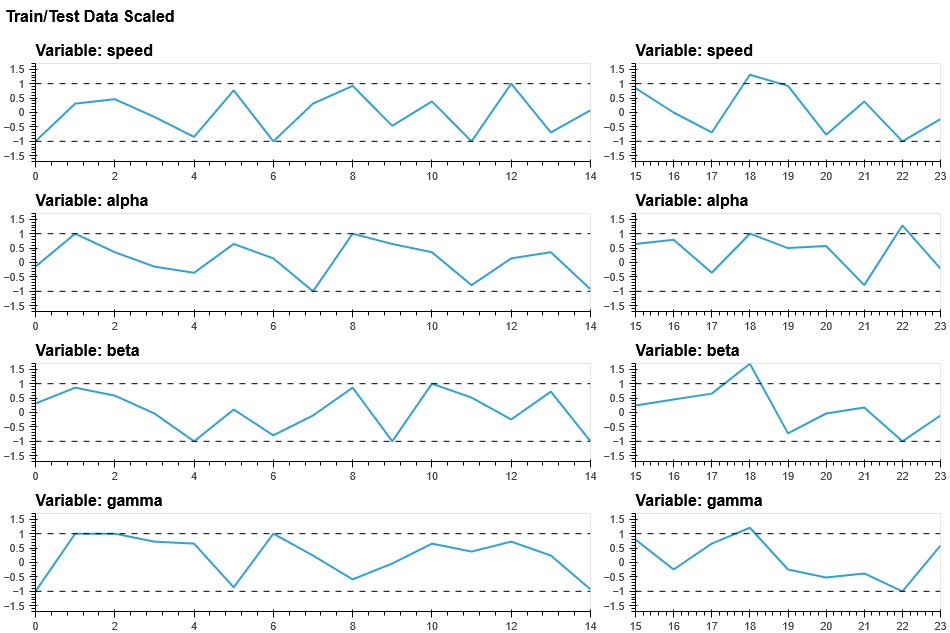
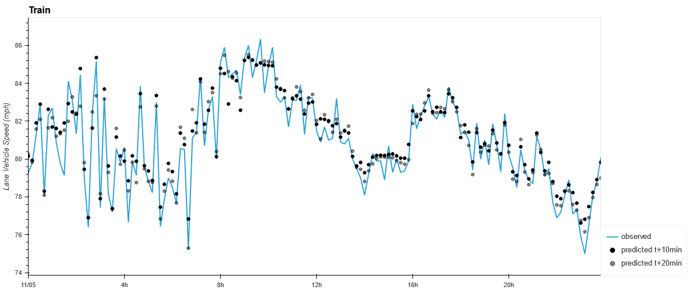
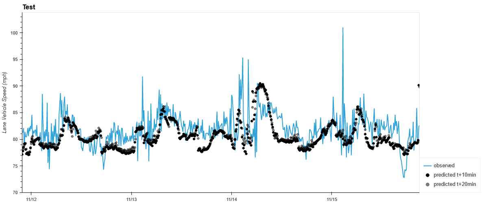
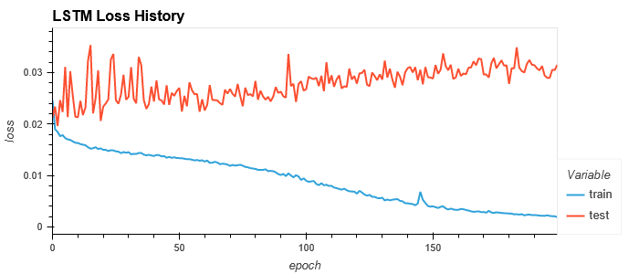

# Time Series Modeling with LSTMs

## Introduction
To enhance my team's capabilities in using autonomous vehicle and streaming
traffic data for analysis and prediction, I developed a prototype model for
predicting highway traffic speeds using high-frequency speed and occupancy data.

## Data Sources
The primary data source is (approximately) one-minute frequency speed and
occupancy data from the Nevada Department of Transportation. For this study
I focused on developing predictions at one site on I-15 south of Las Vegas.
If this approach were to be used in production I would need to develop a model
for each of the several hundred sites in the Las Vegas metro area.




## Data Cleaning
I'm not going to discuss much of the data cleaning process because, while it
took more time than expected, it's not that interesting.

That said, the process went like this:

1. Download detector data in XML every minute.
1. Convert XML to pandas dataframe.
1. Save dataframe to parquet format in interim directory
1. For every file in interim directory:
    1. Extract data for a single site
    1. Combine all data for a single site to one dataframe.
    1. Save dataframe in parquet format to processed directory.
    

Every minute one file is downloaded from an FTP site. The file represents
the speed and occupancy for every detector (approximately 700 detectors) for
a one-minute interval.

Detector data look like this:
```buildoutcfg
<DetectorData>
  <organization-id>NDOT-TTID</organization-id>
  <network-id>LasVegas-D11-1min</network-id>
  <collection-period>
    <collection-period-item>
      <detection-time-stamp>
        <date>20211207</date>
        <time>134217</time>
      </detection-time-stamp>
      <detector-reports>
        <detector-report>
          <detector-id>481_1_124</detector-id>
          <detector-status>1</detector-status>
          <lane-data>
            <lane-data-item>
              <detector-lane-number>1</detector-lane-number>
              <lane-status>1</lane-status>
              <lane-vehicle-count>6</lane-vehicle-count>
              <lane-vehicle-count1>1</lane-vehicle-count1>
              <lane-vehicle-count2>5</lane-vehicle-count2>
              <lane-vehicle-count3>0</lane-vehicle-count3>
              <lane-vehicle-count4>0</lane-vehicle-count4>
              <lane-vehicle-count5>0</lane-vehicle-count5>
              <lane-vehicle-count6>0</lane-vehicle-count6>
              <occupancy>3</occupancy>
              <lane-vehicle-speed>46</lane-vehicle-speed>
            </lane-data-item>
```

So there will be approximately 1440 files downloaded per day. After several days
of downloading, the processing continues with extracting the relevant data from
each file, converting to a pandas dataframe, and storing it temporarily as a
parquet file.

([Parquet](https://arrow.apache.org/docs/python/parquet.html) is an open-source
column store data format that is an ideal format for use with pandas dataframes
because, unlike csv files, data types like timestamps, categorical variables,
integers, and floats are preserved between writes and reads.) 

This process essentially converts each XML file to a much smaller and easier-to-use
parquet file. The data look like:

|   detector_id |   detector_lane_number |   detector_status |   lane_status |   lane_vehicle_count |   occupancy |   lane_vehicle_speed | timestamp           |
|---------------|------------------------|-------------------|---------------|----------------------|-------------|----------------------|---------------------|
|     101_1_755 |                      1 |                 1 |             1 |                    1 |           0 |                   40 | 2021-10-27 18:43:30 |
|     101_1_755 |                      2 |                 1 |             1 |                    7 |           4 |                   38 | 2021-10-27 18:43:30 |
|     101_1_755 |                      3 |                 1 |             1 |                    5 |           3 |                   42 | 2021-10-27 18:43:30 |
|      10_1_267 |                      1 |                 1 |             1 |                    2 |           0 |                   77 | 2021-10-27 18:43:30 |
|      10_1_267 |                      2 |                 1 |             1 |                   23 |           6 |                   71 | 2021-10-27 18:43:30 |


Now there are several thousand parquet files in an interim directory,
representing a few days' worth of data. The next step is to extract the data
from each file for only the sites I'm interested in. I chose one site to model
and extracted the data for that site and its upstream and downstream sites. The
u/s and d/s sites will be additional features in the model, as you will see
below.

## Feature Engineering

After extracting the data I'm interested in, I combine all the data to one
dataframe and continue with feature engineering. Because I am using the
upstream and downstream sites as features in my model, they are added as
columns in the dataframe.

Additional features include: hour-of-day (hod), day-of-week (dow), and day-of-year
(doy). I take the sine and cosine of the hod and doy variables (so that,
for example, the value for hour 23 is close to the value for hour 0. This is
necessary step for any variable with a cyclical nature.) I also perform
one-hot encoding on the categorical variable day of week.

Finally, I recognize that the original data stream does not necessarily arrive
every minute, and that the interval between XML files can be anywhere from 50 to 80
seconds. The models require regular data, so some interpolation must occur. Also,
to make the model training and testing a little quicker, I decided to aggregate
the data to a ten-minute frequency. Speeds and counts were averaged over ten minute 
intervals.

After processing and feature engineering, I saved the dataframe as a parquet
file in the 'processed' directory. The data look like:

| timestamp           |   lane_vehicle_speed |   lane_vehicle_count |   occupancy |   ds_lane_vehicle_speed |   ds_lane_vehicle_count |   ds_occupancy |   us_lane_vehicle_speed |   us_lane_vehicle_count |   us_occupancy |   hod |   sin_hod |   cos_hod |   is_dow_1 |   is_dow_2 |   is_dow_3 |   is_dow_4 |   is_dow_5 |   is_dow_6 |   sin_doy |   cos_doy |
|---------------------|----------------------|----------------------|-------------|-------------------------|-------------------------|----------------|-------------------------|-------------------------|----------------|-------|-----------|-----------|------------|------------|------------|------------|------------|------------|-----------|-----------|
| 2021-10-26 20:10:00 |                85.12 |                 2.89 |        0.33 |                   83.38 |                    2.56 |           0.33 |                   81.44 |                    3.00 |           0.56 | 20.00 |     -0.71 |      0.71 |       1.00 |       0.00 |       0.00 |       0.00 |       0.00 |       0.00 |     -0.90 |      0.44 |
| 2021-10-26 20:20:00 |                81.40 |                 2.50 |        0.20 |                   80.56 |                    2.70 |           0.50 |                   78.44 |                    2.60 |           0.50 | 20.00 |     -0.71 |      0.71 |       1.00 |       0.00 |       0.00 |       0.00 |       0.00 |       0.00 |     -0.90 |      0.44 |
| 2021-10-26 20:30:00 |                79.38 |                 2.90 |        0.40 |                   82.25 |                    2.80 |           0.50 |                   79.33 |                    2.70 |           0.60 | 20.00 |     -0.71 |      0.71 |       1.00 |       0.00 |       0.00 |       0.00 |       0.00 |       0.00 |     -0.90 |      0.44 |
| 2021-10-26 20:40:00 |                84.44 |                 2.90 |        0.50 |                   84.20 |                    2.50 |           0.30 |                   83.89 |                    1.90 |           0.30 | 20.00 |     -0.71 |      0.71 |       1.00 |       0.00 |       0.00 |       0.00 |       0.00 |       0.00 |     -0.90 |      0.44 |
| 2021-10-26 20:50:00 |                81.56 |                 2.67 |        0.22 |                   83.62 |                    2.22 |           0.33 |                   81.25 |                    3.11 |           0.78 | 20.00 |     -0.71 |      0.71 |       1.00 |       0.00 |       0.00 |       0.00 |       0.00 |       0.00 |     -0.90 |      0.44 |


This dataset becomes the starting point for the next step: modeling.

# LSTM Model

## Data Preparation
We've already discussed some of the preparation required for this model, including parsing
the original XML file, extracting relevant data, saving to a more useful format,
resampling to a lower frequency, and some feature engineering of the timestamps.

Next, we need to prepare the data for use in Keras/Tensorflow. I had a hard time wrapping
my head around the format and spent hours trying to figure out tutorials. I had to draw
a lot of diagrams on scratch paper to help me understand it. I'll try to describe the 
process that helped me in the hopes that it helps someone else. If my explanation doesn't
connect with you, please let me know how I can improve it.

Also, I was helped quite a bit by Jason Brownlee's site [Machine Learning Mastery](https://machinelearningmastery.com).
Especially the post titled: [Multivariate Time Series Forecasting with LSTMs in Keras](https://machinelearningmastery.com/multivariate-time-series-forecasting-lstms-keras/).
Check out his excellent tutorials. I ended up doing some of the data prep a little
differently because it had to flow directly from my basic understanding of the data
structure, but I think we arrive at the same place in the end.

To help illustrate my approach, I'll use a dummy data set that's large enough to be
useful but small enough to be able to show the entire data set at a glance. I've
included all the code to generate the data set as well as transform it to a usable
format for Tensorflow.

The four components of this process are: Organize original data, train/test split, min/max
scaling, and reshaping data.

### Original Data

My dummy data set consists of four columns: speed, alpha, beta, and gamma. We will build
a model to predict speed using all four features (remember that speed itself is used as 
a predictor, too). There are 24 rows and four columns. The code used to generate these
data are below:

First, some imports and setup:

```python
import numpy as np
import pandas as pd
from pandas import read_csv
from datetime import datetime
from pathlib import Path
import holoviews as hv
import hvplot.pandas

from sklearn.preprocessing import MinMaxScaler

np.set_printoptions(edgeitems=20, linewidth=100000, formatter=dict(float=lambda x: "%6.3f" %x))
pd.options.display.float_format = '{:,.3f}'.format
```

Next, generate the dataset:
```python
import numpy as np

# set the one-hit-wonder seed so your data is exactly the same as mine
np.random.seed(8675309)
data_array = np.random.randint(low=0, high=33, size=(24,4))
# modify a data point to make a point later about scaling
data_array[18, 2] = 40

# Cast to dataframe to help with processing and display
data = pd.DataFrame(data_array, columns=['speed', 'alpha', 'beta', 'gamma'])
# Add a constant to each column. This just makes it easier for me to do QA if the
#    columns look a little different. It has no effect on this analysis, but if you
#    want to follow along with your own code and try to match these results, execute
#    the next three lines.
data['alpha'] = data['alpha'] + 100
data['beta'] = data['beta'] + 200
data['gamma'] = data['gamma'] + 300
data
```




### Train/Test Split

The next step is to split your data into training and testing data sets. For the actual
highway speed and occupancy data described above I chose a train-test-split of 0.8, meaning
the first 80% of the data was used for training a model and the last 20% for testing. For
the dummy data here I chose a 2/3 - 1/3 split, just so I could get enough batches of data
into the test array (that sentence will make way more sense later).

Taking the first 67% of the data means rows 0-14 will be used for training and rows 15-23
will be used for testing.

At this point we can also take the data out of the dataframe and just use the raw numpy
arrays. Just remember that the thing we're trying to predict (speed) is in column 0.

Train
```python
array([[  1, 112, 220, 300],
       [ 18, 128, 228, 329],
       [ 20, 119, 224, 329],
       [ 12, 112, 215, 325],
       [  3, 109, 201, 324],
       [ 24, 123, 217, 302],
       [  1, 116, 204, 329],
       [ 18, 100, 214, 318],
       [ 26, 128, 228, 306],
       [  8, 123, 201, 314],
       [ 19, 119, 230, 324],
       [  1, 103, 223, 320],
       [ 27, 116, 212, 325],
       [  5, 119, 226, 318],
       [ 15, 101, 201, 301]])
```

Test
```python
array([[ 25, 123, 219, 326],
       [ 14, 125, 222, 311],
       [  5, 109, 225, 324],
       [ 31, 128, 240, 332],
       [ 26, 121, 205, 311],
       [  4, 122, 215, 307],
       [ 19, 103, 218, 309],
       [  1, 132, 201, 300],
       [ 11, 111, 214, 323]])
```

### Min/Max Scaling

Next, we need to scale our data. There are good explanations for scaling the inputs
[here](https://stackoverflow.com/questions/46686924/why-scaling-data-is-very-important-in-neural-networklstm), 
[here](https://machinelearningmastery.com/how-to-improve-neural-network-stability-and-modeling-performance-with-data-scaling/),
and [here](https://datascience.stackexchange.com/questions/39881/scaling-features-in-artificial-neural-networks)
and I won't plagiarize them too much here, but, in general, a neural network with
scaled inputs will train faster and is less likely to get stuck in local minima.

Important note: I see this mistake a lot in other blog posts: Do not fit your scaler to
the entire dataset. You must fit the scaler to the training data, then transform both
the train and test data using the training scaler. Otherwise you get information leakage,
where you are effectively taking some information from the test data to inform the model
during training.

I chose to scale my inputs to the [-1, 1] range by fitting scikit-learn's MinMaxScaler
on the full training data set (called X_scaler). I also fit a separate scaler to the speed data by itself
(y_scaler) for convenience later. Since the scaler operates on columns independently,
there is no harm in creating a separate scaler (except that it introduces a little more
code management and bookkeeping). Then, I transformed both the train and test data
using X_scaler and y_scaler.

```python
X_scaler = MinMaxScaler(feature_range=(-1, 1))
y_scaler = MinMaxScaler(feature_range=(-1, 1))

# fit the scalers to training data
X_scaler.fit(x_train)
# fit a separate scaler to the speed data for use later
y_scaler.fit(y_train)

# transform (scale) both the training and the test data
x_train_scaled = X_scaler.transform(x_train)
y_train_scaled = y_scaler.transform(y_train)

x_test_scaled = X_scaler.transform(x_test)
y_test_scaled = y_scaler.transform(y_test)
```
```python
x_train_scaled
[[-1.000 -0.143  0.310 -1.000]
 [ 0.308  1.000  0.862  1.000]
 [ 0.462  0.357  0.586  1.000]
 [-0.154 -0.143 -0.034  0.724]
 [-0.846 -0.357 -1.000  0.655]
 [ 0.769  0.643  0.103 -0.862]
 [-1.000  0.143 -0.793  1.000]
 [ 0.308 -1.000 -0.103  0.241]
 [ 0.923  1.000  0.862 -0.586]
 [-0.462  0.643 -1.000 -0.034]
 [ 0.385  0.357  1.000  0.655]
 [-1.000 -0.786  0.517  0.379]
 [ 1.000  0.143 -0.241  0.724]
 [-0.692  0.357  0.724  0.241]
 [ 0.077 -0.929 -1.000 -0.931]]

x_test_scaled
[[ 0.846  0.643  0.241  0.793]
 [ 0.000  0.786  0.448 -0.241]
 [-0.692 -0.357  0.655  0.655]
 [ 1.308  1.000  1.690  1.207]
 [ 0.923  0.500 -0.724 -0.241]
 [-0.769  0.571 -0.034 -0.517]
 [ 0.385 -0.786  0.172 -0.379]
 [-1.000  1.286 -1.000 -1.000]
 [-0.231 -0.214 -0.103  0.586]]

```

Plots (first column is the scaled training data, second column is scaled test data).


You may notice from the data or plots that even though I scaled the data between -1 and 1,
some of the scaled test data exceeds those limits. This is OK, since the scaler
only considered data from the training data (note that none of the data in the training
data exceeds the limits) and some of the test data may exceed the min or max of the
training data.

### Reshape Data

So now that we have a scaled train and test data set, we can prepare the data for use
with Keras/Tensorflow. This is the step that caused me a lot of grief and to help me
figure it out I had to sketch out a few diagrams. I hope my explanation will make sense
and help someone.

Keras requires the data for the LSTM application to be in the shape (n_batches, n_obs, n_dimensions)
where n_obs is the number of observations in the past to use for training, n_batches is
the number of batches (described below), and n_dimensions is the number of features plus
the variable we're predicting.

First, to define what a batch is, I need to decide how far back to look (n_obs)
and how far forward to predict (which I call n_forecast). For this dummy data set, I
chose n_obs = 3 and n_forecast = 2. A batch is then defined as the minimum data slice
required to make a prediction. In this case, it is a 3-row slice of historic data and a
2-row slice of future data. 

There are lots of tutorials out there describing how to reshape your data, but drawing
pictures helped me. I start with knowing that I need to turn my 2D array into 3D, and
create an empty numpy array with shape (n_batches, n_obs, n_dimensions). Dimensions are
the same as features and in our dummy example we have four (including speed). Number of
observations is user-supplied; in this case I chose three. The number of batches depends
on the size of your data, the number of observations, and the number of forecast values.

I don't have a great way to define a batch, but it helps me to think of a single batch
as a subset of the data used to make one prediction. To make a prediction we need
an X and a y array. Starting with our scaled training data (x_train_scaled), we can use
this data for batch 0:


So the first batch contains rows 0, 1, 2 for part of the X array and rows 3, 4 (and
column 0 only) for the y array.

The second batch (batch 1) contains rows 1, 2, 3 for X and rows 4, 5 (col 0) for y:


A little bit of algebra can show us that for a data set with num_rows total, there will
be `num_rows - n_obs - n_forecast + 1` batches. In our dummy example the training data
set will have `15 - 3 - 2 + 1 = 11` batches and the testing data will have
`9 - 3 - 2 + 1 = 5` batches.

More broadly, the following diagrams illustrate where batches 0, 1, and 10 for the
training data fit into the larger picture:


My approach to building the 3D arrays for X_train, y_train, X_test, and y_test is to
create an empty numpy array for each and populate it slice by slice by iterating through the
scaled data set. I read somewhere, but haven't tested it, that this approach is more
efficient than building up your array by successive re-sizing. I believe the latter
approach involves copying the array each time, whereas the former simply assigns data
to existing locations.

The following code is what I used to create the 3D arrays for the training data set;
similar code was used for testing but not shown here:

```python
n_obs = 3
n_forecast = 2
train_data_length = x_train_scaled.shape[0]

# instantiate empty 3D arrays
n_batches = train_data_length - n_obs - n_forecast + 1
n_dimensions = x_train_scaled.shape[1]
# note: I'm re-using variable names (X_train/y_train) here to match what is used in every other tutorial out there.
#   I realize it's probably bad form, but the alternative is sometimes an unwieldy combination of
#   'tmp' and way too many underscores to describe every intermediate data set. Sometimes it's OK to
#   break the rules and just move one, so let's do that.
X_train = np.empty((n_batches, n_obs, n_dimensions))
y_train = np.empty((n_batches, n_forecast))

# populate arrays
for i in range(n_batches):
    X_train[i, :, :] = x_train_scaled[i:(i + n_obs), :]
    y_train[i, :] = x_train_scaled[(i + n_obs):(i + n_obs + n_forecast), 0]
```

This results in the X_train data with shape (11, 3, 4) and y_train data with shape
(11, 2):
```python
X_train
array([[[-1.000, -0.143,  0.310, -1.000],
        [ 0.308,  1.000,  0.862,  1.000],
        [ 0.462,  0.357,  0.586,  1.000]],

       [[ 0.308,  1.000,  0.862,  1.000],
        [ 0.462,  0.357,  0.586,  1.000],
        [-0.154, -0.143, -0.034,  0.724]],

       [[ 0.462,  0.357,  0.586,  1.000],
        [-0.154, -0.143, -0.034,  0.724],
        [-0.846, -0.357, -1.000,  0.655]],

       [[-0.154, -0.143, -0.034,  0.724],
        [-0.846, -0.357, -1.000,  0.655],
        [ 0.769,  0.643,  0.103, -0.862]],

       [[-0.846, -0.357, -1.000,  0.655],
        [ 0.769,  0.643,  0.103, -0.862],
        [-1.000,  0.143, -0.793,  1.000]],

       [[ 0.769,  0.643,  0.103, -0.862],
        [-1.000,  0.143, -0.793,  1.000],
        [ 0.308, -1.000, -0.103,  0.241]],

       [[-1.000,  0.143, -0.793,  1.000],
        [ 0.308, -1.000, -0.103,  0.241],
        [ 0.923,  1.000,  0.862, -0.586]],

       [[ 0.308, -1.000, -0.103,  0.241],
        [ 0.923,  1.000,  0.862, -0.586],
        [-0.462,  0.643, -1.000, -0.034]],

       [[ 0.923,  1.000,  0.862, -0.586],
        [-0.462,  0.643, -1.000, -0.034],
        [ 0.385,  0.357,  1.000,  0.655]],

       [[-0.462,  0.643, -1.000, -0.034],
        [ 0.385,  0.357,  1.000,  0.655],
        [-1.000, -0.786,  0.517,  0.379]],

       [[ 0.385,  0.357,  1.000,  0.655],
        [-1.000, -0.786,  0.517,  0.379],
        [ 1.000,  0.143, -0.241,  0.724]]])

y_train
array([[-0.154, -0.846],
       [-0.846,  0.769],
       [ 0.769, -1.000],
       [-1.000,  0.308],
       [ 0.308,  0.923],
       [ 0.923, -0.462],
       [-0.462,  0.385],
       [ 0.385, -1.000],
       [-1.000,  1.000],
       [ 1.000, -0.692],
       [-0.692,  0.077]])
```

After reshaping X_train, y_train, X_test, and y_test into the 3D array structure required
by Keras/Tensorflow, we are ready to begin modeling.

But first, for those of you following along at home, all the code I used to get to this
point is reproduced below.

## Code
### Imports and Setup
```python
import numpy as np
import pandas as pd

from sklearn.preprocessing import MinMaxScaler

n_obs = 3
n_forecast = 2
```
### Original Data
```python
# set the one-hit-wonder seed so your data is exactly the same as mine
np.random.seed(8675309)
data_array = np.random.randint(low=0, high=33, size=(24,4))

# modify a data point to make a point later about scaling
data_array[18, 2] = 40

# Cast to dataframe to help with processing and display
data = pd.DataFrame(data_array, columns=['speed', 'alpha', 'beta', 'gamma'])

# Add a constant to each column. This just makes it easier for me to do QA if the
#    columns look a little different. It has no effect on this analysis, but if you
#    want to follow along with your own code and try to match these results, execute
#    the next three lines.
data['alpha'] = data['alpha'] + 100
data['beta'] = data['beta'] + 200
data['gamma'] = data['gamma'] + 300
```
### Train/Test Split
```python
# train test split
train_fraction = 0.66
num_train_rows = int(train_fraction * data.shape[0])

train = data.iloc[:num_train_rows].copy()
x_train = train.values
# force y to be 2D
y_train = x_train[:, 0].reshape(-1, 1)

test = data.iloc[num_train_rows:].copy()
x_test = test.values
# force y to be 2D
y_test = x_test[:, 0].reshape(-1, 1)
```
### Min/Max Scaling
```python
X_scaler = MinMaxScaler(feature_range=(-1, 1))
y_scaler = MinMaxScaler(feature_range=(-1, 1))

# fit the scalers to training data
X_scaler.fit(x_train)
# fit a separate scaler to the speed data for use later
y_scaler.fit(y_train)

# transform (scale) both the training and the test data
x_train_scaled = X_scaler.transform(x_train)
y_train_scaled = y_scaler.transform(y_train)

x_test_scaled = X_scaler.transform(x_test)
y_test_scaled = y_scaler.transform(y_test)
```
### Reshape
```python
# Reshape training data
train_data_length = x_train_scaled.shape[0]

# instantiate empty 3D arrays
n_batches = train_data_length - n_obs - n_forecast + 1
n_dimensions = x_train_scaled.shape[1]
X_train = np.empty((n_batches, n_obs, n_dimensions))
y_train = np.empty((n_batches, n_forecast))

# populate arrays
for i in range(n_batches):
    X_train[i, :, :] = x_train_scaled[i:(i + n_obs), :]
    y_train[i, :] = x_train_scaled[(i + n_obs):(i + n_obs + n_forecast), 0]

```
```python
# Reshape test data
test_data_length = x_test_scaled.shape[0]

# instantiate 3D arrays
n_batches = test_data_length - n_obs -n_forecast + 1
n_dimensions = x_test_scaled.shape[1]
X_test = np.empty((n_batches, n_obs, n_dimensions))
y_test = np.empty((n_batches, n_forecast))

# populate array
for i in range(n_batches):
    X_test[i, :, :] = x_test_scaled[i:(i + n_obs), :]
    y_test[i, :] = x_test_scaled[(i + n_obs):(i + n_obs + n_forecast), 0]
```

Your data transformation process should look like:


All of this using dummy data was simply to illustrate the process. For my actual analysis,
described above, my original data set was 2886 rows and 20 columns after downsampling and
feature engineering.

```python
DatetimeIndex: 2886 entries, 2021-10-26 20:10:00 to 2021-11-15 21:00:00
Data columns (total 20 columns):
 #   Column                 Non-Null Count  Dtype  
---  ------                 --------------  -----  
 0   lane_vehicle_speed     2886 non-null   float64
 1   lane_vehicle_count     2886 non-null   float64
 2   occupancy              2886 non-null   float64
 3   ds_lane_vehicle_speed  2886 non-null   float64
 4   ds_lane_vehicle_count  2886 non-null   float64
 5   ds_occupancy           2886 non-null   float64
 6   us_lane_vehicle_speed  2886 non-null   float64
 7   us_lane_vehicle_count  2886 non-null   float64
 8   us_occupancy           2886 non-null   float64
 9   hod                    2886 non-null   int64  
 10  sin_hod                2886 non-null   float64
 11  cos_hod                2886 non-null   float64
 12  is_dow_1               2886 non-null   uint8  
 13  is_dow_2               2886 non-null   uint8  
 14  is_dow_3               2886 non-null   uint8  
 15  is_dow_4               2886 non-null   uint8  
 16  is_dow_5               2886 non-null   uint8  
 17  is_dow_6               2886 non-null   uint8  
 18  sin_doy                2886 non-null   float64
 19  cos_doy                2886 non-null   float64
dtypes: float64(13), int64(1), uint8(6)
```

### Discussion
Before we start modeling I want to stress one thing: a lot of work went into gathering, cleaning, feature engineering, and shaping the data. It's not
always obvious when you see someone's cleaned up code, but there is a lot of work and hundreds of lines of
throwaway code involved in looking at the
data, finding outliers, figuring out why the data looks a certain way, figuring out when a value shouldn't be
taken as an actual value, plotting, etc. In the DOT traffic data, we're dealing with traffic speed and it
isn't out of the question to see an observed speed of 129 mph. It's definitely out of the ordinary, but not
too surprising. So one would be tempted to just use the data as-is. However, when I explored the data a little more,
I found that the only two values for speed above 105 or so were 129 and 145 mph. And there were lots of these
values--never 128, 130, 144 or 146. Only 129 and 145. I suspected there was something about the data collection
process, either in software or hardware, that used those values as placeholders when something went wrong. So
even though 129 is technically an acceptable speed, I chose to remove anything above 115 mph and assume the 
value was an error. These kinds of decisions can only be made with some domain knowledge (we've all driven
on the freeways and know how fast cars generally go) and inspection using simple tools like histograms, line plots,
and even sorting the data in a spreadsheet.

## Predictions
We're finally ready to actually build a model and make some predictions. Our data is clean and shapely and ready
to get modeled.

I chose to use a long short-term memory (LSTM) recurrent neural network to predict speed based on multiple
inputs. As of now this model is just a proof-of-concept. Ideally we would have a year or two of data and build
a model that can capture more variability in the processes governing highway traffic. Unfortunately there was
only a couple of weeks of data available, but we'll make do with what we have.

### Define a Model
Defining a RNN model involves a little bit of trial and error. To start, I defined the first layer to have
as many neurons as a single batch in X_train. Previously, when reshaping my data, I chose to use the previous
60 minutes of data to predict the next 20 minutes. Given that I have data at a 10-minute frequency, `n_obs = 6`
and `n_forecast = 2`. The number of features (or dimensions) is `n_dimensions = 20`, so the numbers of neurons
I chose for the first layer is 120.

At the end of the model I chose the number of dense neurons to be equal to the number of values I'm trying to
predict (`n_forecast = 2`).

Also, as recommended in many other tutorials, I added a dropout layer between each layer to reduce overfitting.

```python
from keras.models import Sequential # Deep learning library, used for neural networks
from keras.layers import LSTM, Dense, Dropout # Deep learning classes for recurrent and regular densely-connected layers
from keras.callbacks import EarlyStopping # EarlyStopping during model training

LSTMmodel = Sequential()

n_neurons = X_train.shape[1] * X_train.shape[2]
dense_neurons = y_train.shape[1]

LSTMmodel.add(LSTM(n_neurons, return_sequences=True, input_shape=(X_train.shape[1], X_train.shape[2])))
LSTMmodel.add(Dropout(0.3))
LSTMmodel.add(LSTM(n_neurons, return_sequences=True))
LSTMmodel.add(Dropout(0.3))
LSTMmodel.add(LSTM(n_neurons, return_sequences=True))
LSTMmodel.add(Dropout(0.3))
LSTMmodel.add(LSTM(n_neurons, return_sequences=False))
LSTMmodel.add(Dropout(0.3))
LSTMmodel.add(Dense(dense_neurons))

# Compile the model
LSTMmodel.compile(optimizer='adam', loss='mse')
```

My final model has an initial input layer, three hidden layers, and a dense output layer:
```python
>>>LSTMmodel.summary()

Model: "sequential"
_________________________________________________________________
Layer (type)                 Output Shape              Param #   
=================================================================
lstm (LSTM)                  (None, 6, 120)            67680     
_________________________________________________________________
dropout (Dropout)            (None, 6, 120)            0         
_________________________________________________________________
lstm_1 (LSTM)                (None, 6, 120)            115680    
_________________________________________________________________
dropout_1 (Dropout)          (None, 6, 120)            0         
_________________________________________________________________
lstm_2 (LSTM)                (None, 6, 120)            115680    
_________________________________________________________________
dropout_2 (Dropout)          (None, 6, 120)            0         
_________________________________________________________________
lstm_3 (LSTM)                (None, 120)               115680    
_________________________________________________________________
dropout_3 (Dropout)          (None, 120)               0         
_________________________________________________________________
dense (Dense)                (None, 2)                 242       
=================================================================
Total params: 414,962
Trainable params: 414,962
Non-trainable params: 0
_________________________________________________________________
```

### Fit
Fitting this model structure to the training data set (X_train, y_train) can be accomplished with the following:
```python
# Training the model
epochs = 200
batch_size = 16
early_stop = EarlyStopping(monitor='loss', patience=5, verbose=1)
history = LSTMmodel.fit(X_train, y_train, 
                    batch_size=batch_size, 
                    epochs=epochs,
                    validation_data=(X_test, y_test),
                    verbose=2
                   )
```

There is more investigation that can be done with respect to the number of epochs and batch_size, but for now
we'll move forward with what we have.

Training this model took about ten minutes on a modern big-box desktop. Previous attempts at training with one-
minute instead of ten-minute data suggested that downscaling my data by a factor of ten reduced training time
by about a factor of 100. Something to consider if you are short on resources or find that a reduced frequency
is just as valuable to you.

### Predict
Predicting is as simple as feeding the X_test data to the `predict` method of our LSTMmodel.
```python
y_test_predicted = LSTMmodel.predict(X_test)
```
After predicting I used the scalers developed earlier to inverse transform the data and re-cast all the
data to a dataframe for ease of analysis and plotting.

As you can see from the small subset of training data and predictions, the model is likely overfitting.



At first glance test results look promising. The predictions seem to follow the general trend but
miss out on most of the peaks.



We might consider this a good first try at predicting speed, but inspection of the loss history
suggests there are bigger issues with the calibration.



The test data loss should be decreasing with every epoch, and this plot tells me that additional
training epochs will not improve the accuracy of the model. Even with an acceptable mean absolute
error (MAE) of 2.3 mph, I don't have much confidence in this model's predictive capability. That's
not surprising, however, and I don't think any more tuning is going to improve this model. Even
going into this modeling exercise I knew that two weeks of data was not nearly enough training
data for a highway prediction application; ideally I would have at least a year of training data
and several months for testing.

## Summary

The purpose of this exercise and post was to explore the details of developing a time series
model using LSTMs. Specifically, I hope that describing the process of cleaning, downsampling,
feature engineering, and especially re-shaping the data is helpful to some readers.


