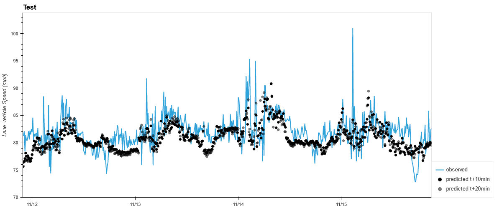

# hi

# LSTM

# Introduction
To enhance my team's capabilities in using autonomous vehicle and streaming
traffic data for analysis and prediction, we developed a prototype model for
predicting highway traffic speeds using high-frequency speed and occupancy data.

# Data Sources
The primary data source is (approximately) one-minute frequency speed and
occupancy data from the Nevada Department of Transportation. For this study
I focused on developing predictions at one site on I-15 south of Las Vegas.
If this approach were to be used in production I would need to develop a model
for each of the several hundred sites in the Las Vegas metro area.

|   a |   b |
|-----|-----|
|   1 |   4 |
|   2 |   5 |
|   3 |   6 |

